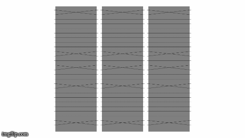

# OpenHacks2020
Our entry for the [OpenHacks](https://hack.theopencode.org/) hackathon in 2020. 

## What is it supposed to do?

The idea was to encrypt text using an Enigma-like mechanism and rendering the process in some sort of GUI.

## What does it do?

Unfortunately, the rendering is not quite done yet. This was developed in a 24 hour time frame by two people who had no idea how to make anything graphics related.

The best you can do, at the moment, is create a series of images and then convert them to a GIF using a tool of your chosing, like so: 



As you can see, the image doesn't look very telling yet. We were hoping to build a proper GUI using Swing but in the last few hours we had to scratch that idea and do something a little simpler. A few bugfixes later, we ended up with this.

Currently, the program is configured to take a config file and a string to encrypt. Then it returns the encrypted string.

## How do I use it?

To run the program, do 

```
$ ./gradlew run --args="config/example.cfg HELLOWORLD"
```